# 混合大模型一站式管理系统 (Mixed Multimodal LLM Management System)

## 📋 系统概述

本系统（混合大模型管理系统）是一套面向本地部署的大语言模型综合管理平台，集 **文件管理、用户权限、模型调度、AI 对话、系统监控** 于一体，提供安全、高效、便捷的一站式操作体验。

系统基于 Java + Spring Boot 构建，前端采用 Bootstrap 5，后端通过 llama.cpp 调度本地 GGUF 格式的大语言模型，同时支持 OpenAI 兼容的远程 API 接入。其核心目标是解决本地模型部署中繁琐的路径权限管理、模型参数配置以及资源监控问题。

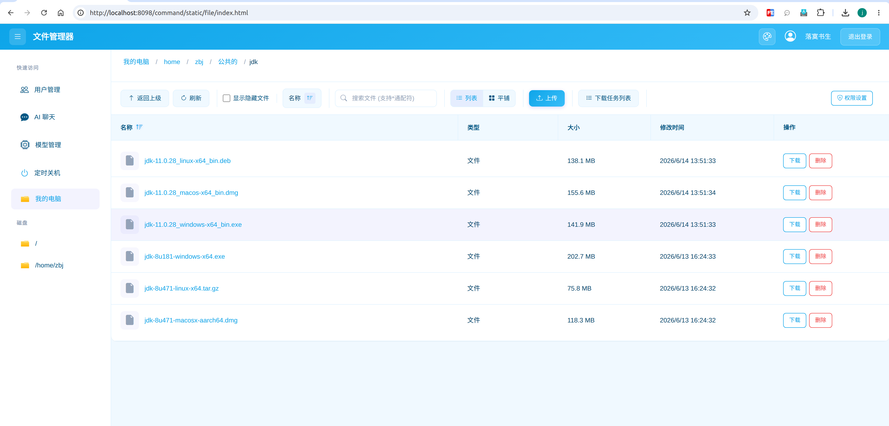

**版本说明**

| 版本 | 版本号后缀 | 说明 | 包含功能 |
| :--- | :--- | :--- | :--- |
| **基础版** | `release_base` | 精简部署版本 | 文件管理、用户管理、AI 聊天、权限体系等核心功能 |
| **完全版** | `release_ultimate` | 全功能版本 | 基础版全部功能 + 模型管理、资源监控、定时开关机等高级功能 |

> ⚠️ **多模态能力说明**：当前版本多模态能力 **仅支持图片输入**，不支持音频和视频输入。
>
> ⚠️ **定时关机/重启兼容性说明**：该功能依赖于底层操作系统的指令集及硬件支持，并非所有机型均能正常运行。当前测试系统情况：双路 X99 (Ubuntu 22.04， E5-2696 v4) 和 Mac M1 Pro 关机/重启均正常；Windows 10 64位 (z690 主板， i7-13700K) 关机功能正常，但自动唤醒重启受主板 BIOS 限制，自测无法唤醒。
>
> ⚠️ **GPU 监控兼容性说明**：GPU 监控功能依赖 `nvidia-smi` 工具，**仅支持搭载 NVIDIA 显卡的系统**。macOS 系统使用 Apple Silicon (M 系列) 或集成显卡，无对应监控接口，因此 macOS 下不提供 GPU 监控面板。

## 🌟 核心功能亮点

### 1. 极简部署与多平台兼容

- **零数据库依赖**：无需安装 MySQL/PostgreSQL 等数据库，单 Jar 包部署，启动即运行。
- **多平台支持**：兼容 **Windows**， **Linux (Ubuntu)**， **macOS (Apple Silicon)**。
- **完全离线运行**：前端资源 100% 本地化，不依赖任何外网 CDN，满足极高安全要求的内网环境。

### 2. 文件管理

- **智能上传**：支持文件拖拽上传和大文件分片上传，右侧任务栏实时显示每个分片的上传进度和整体百分比。

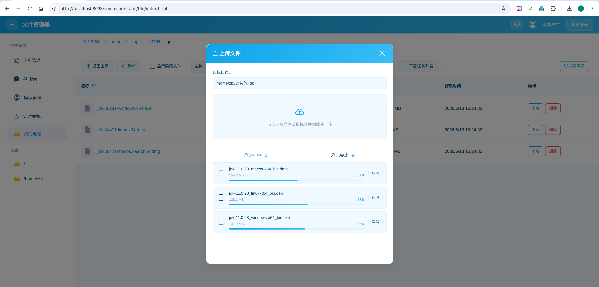

- **灵活下载**：支持文件或者文件夹下载，单个文件是直接下载，文件夹自动后台打包为 `.zip` 压缩包，可以在下载任务列表查看文件夹压缩是否完成
- **多媒体预览**：支持多种多媒体格式预览，无需下载即可查看内容。
  - 图片 (JPG， PNG)：支持全屏查看
  - 视频：支持 Range 请求，可随意拖动进度条
  - 文档 (PDF)：支持在线预览
  - 文本/代码：支持 TXT， Java， Python， JS， HTML， JSON， YAML 等常见文本格式预览
- **搜索**：支持文件名模糊匹配，可使用通配符（如 `*.py`）快速筛选特定类型文件。
- **视图切换**：支持列表视图（显示详细属性）与平铺视图（适合图片浏览）切换。
- **安全删除**：删除操作需二次确认，严格校验 `DELETE` 权限，受保护路径即使管理员也无法删除。

### 3. 细粒度权限体系

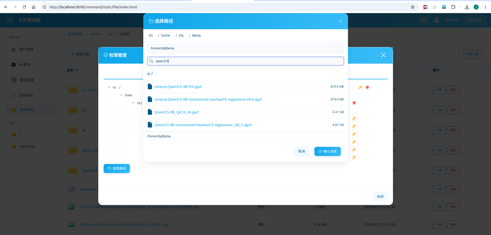

- **路径继承机制**：访问文件时若未设置规则，系统自动向上追溯至父目录直到找到最近匹配规则。

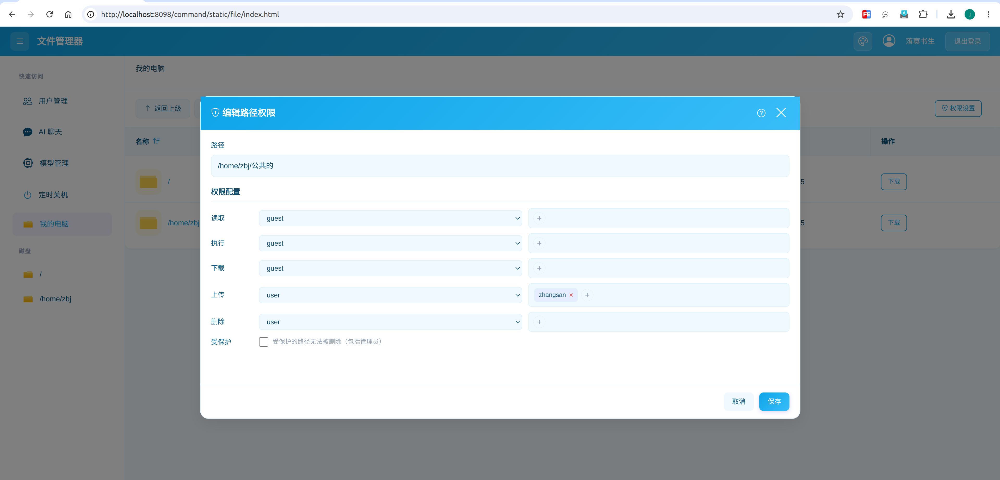

- **权限级联 (优先级)**：**删除 > 上传 > 下载 > 执行 > 读取**，高级权限自动包含低级权限。
- **角色与用户双重校验**：每项权限可配置最小允许角色，同时支持添加特定授权用户名单。
- **路径穿透 (Path Penetration)**：即使没有父目录执行权限，只要拥有深层文件的读取权限即可直接访问。
- **权限树管理**：可视化树形结构，直观查看整个系统权限分布，快速定位并修改特定子目录权限。
- **路径保护机制**：受保护路径在文件管理界面显示特殊标识，所有删除请求直接拦截。

### 4. 用户全生命周期管理

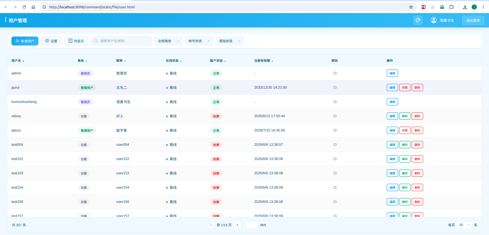

- **角色管理**：支持管理员 (Admin)、普通用户 (User)、访客 (Guest) 三种角色，可随时切换。
- **状态控制**：一键封禁/解封，被封禁用户登录时触发解封申请流程，管理员可实时处理。
- **访客有效期**：可配置访客账号默认有效期（天数），系统定期扫描过期账号并自动封禁。
- **自助注册**：开启访客注册后，用户可在登录页自助注册，账号自动获得预设有效期。

### 5. 智能 AI 对话

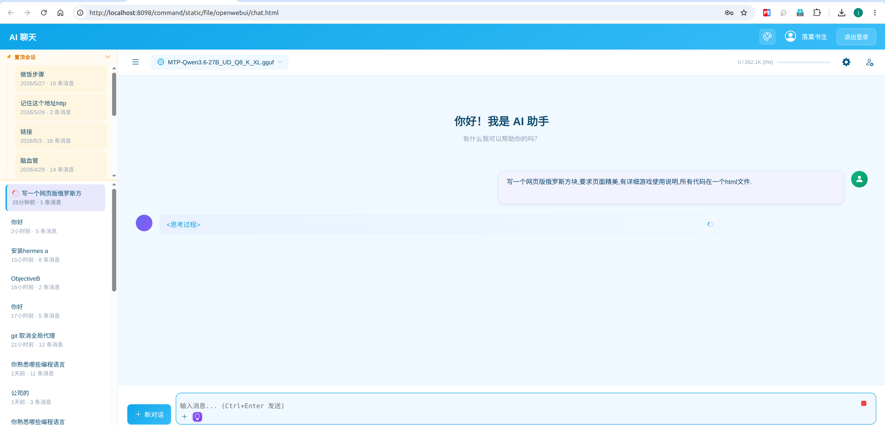

- **对话管理**：支持新建对话、加载历史、删除会话、重命名、置顶常用会话。
- **多方式附件上传**：

  - 图片上传：AI 可识别图片中的文字内容 (OCR)
  - 文本文件上传：自动提取 `.txt`， `.java`， `.py`， `.js` 等文本内容供 AI 分析

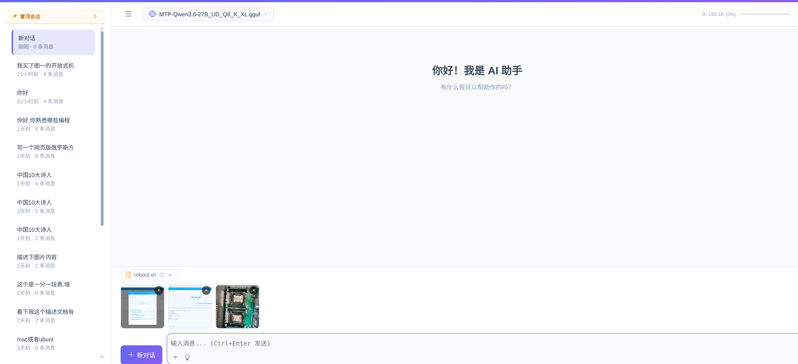

  - 文件夹上传：支持整个文件目录列表上传。若模型支持图片输入则包含图片文件，否则仅包含纯文本文件

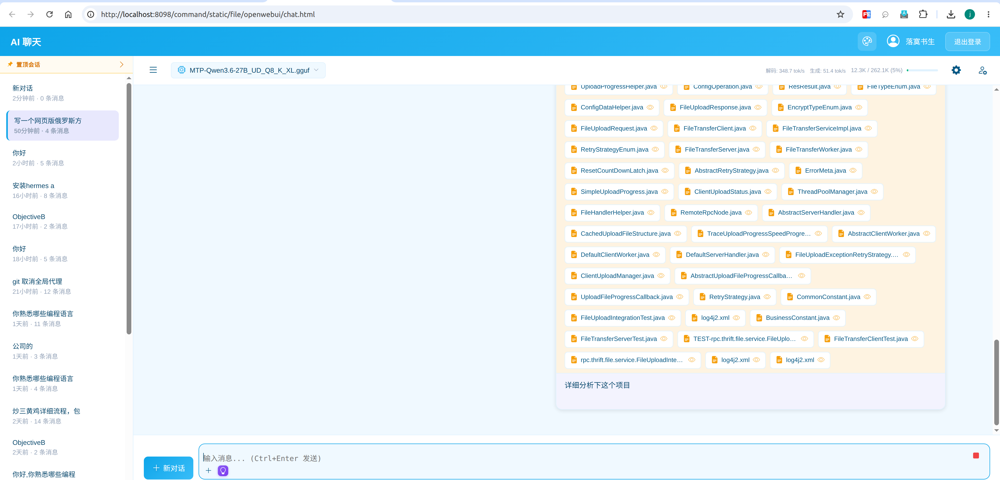

  - 粘贴文件路径：输入框中粘贴路径，系统自动识别并上传
  - 复制文件粘贴：在文件管理器或 IDE 中复制文件后，直接在聊天输入框粘贴即可

- **代码生成**：AI 生成的代码块支持一键复制、保存为本地文件，长代码支持折叠显示。
- **深度思考模式**：支持 qwen3.5， qwen3.6， gemma4 等模型的深度思考功能，输入框灯泡图标高亮即表示开启。
- **系统级配置**：管理员可配置 OpenAPI 接入、模型功能定义（正则匹配开启/关闭思考模式）、按角色限制附件大小和最大消息数。
- **对话统计**：实时显示 prompt prefill 速度、decode 速度、当前对话上下文占比等性能指标。

### 6. 深度集成 llama.cpp 推理引擎
 **也支持添加ik_llama.cpp作为推理引擎(非必填)**，如果配置了该路径，模型启动时候，支持选择llama.cpp和ik_llama.cpp两种推理引擎。(gguf自动分片底层还是用的是llama.cpp，如果是ik_llama.cpp的分片，可能需要手动合并)
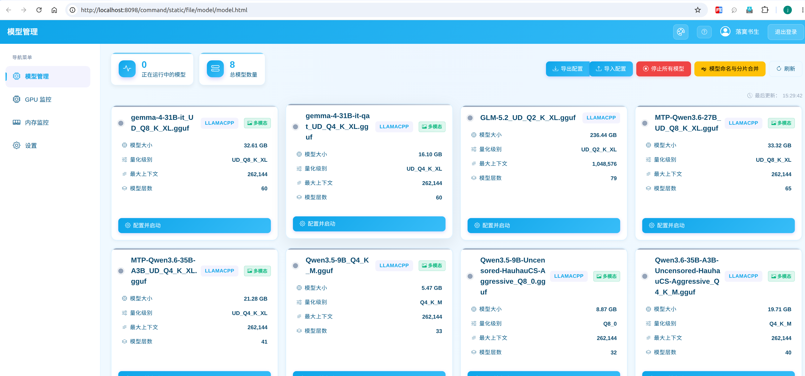

- **多 GPU 并行加速**：全面支持 llama.cpp 的 **SM Tensor** 调度，实现多卡并行推理。
- **MTP 预测加速**：支持 **Multi-Token Prediction** 多 Token 预测，显著减少推理步数。
- **多种量化格式支持**：支持 F32/BF16/F16Q8_0/Q8_K、 Q6_K、 Q5_K_M、 Q4_K_M、IQ3_XXS 等常见的多种量化类型。
- **GGUF 自动化管理**：
  - 自动识别分片文件（如 `model-00001-of-00002.gguf`）并一键合并
  - 内置命名规范检查，确保模型文件命名统一（格式：`模型名_量化类型.gguf`）
  - 自动匹配 `mmproj` 多模态投影文件和 `mtp` Draft 模型文件
- **精细化启动参数**：支持上下文大小、GPU 加载层数、并行任务数、张量分割、KV Cache 量化、温度、线程数、批处理大小等 18+ 参数调优。

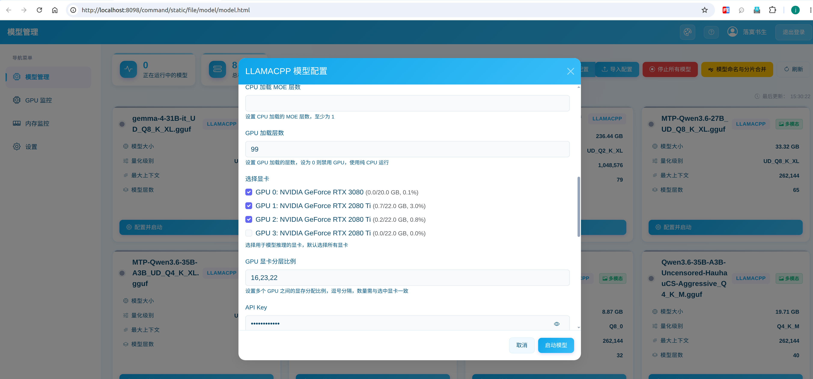

### 7. 实时资源监控

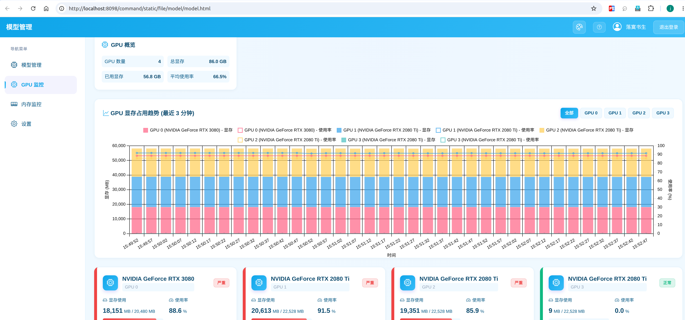

- **GPU 监控**：集成 `nvidia-smi` 实时解析，每 10 秒同步一次数据，记录最近 60 个样本的趋势图，直观查看每张显卡类型和显存占用。

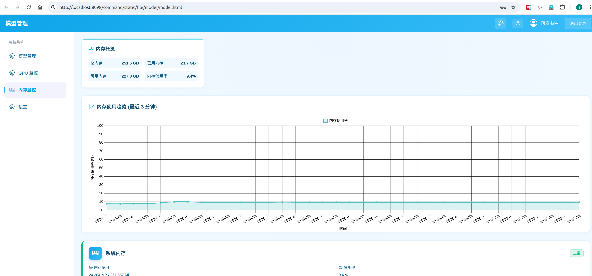

- **内存监控**：实时显示总内存、已用内存、可用内存及整体使用率百分比，绘制近 3 分钟内存使用波动曲线，帮助分析模型加载时的内存峰值。

### 8. 智能定时重启

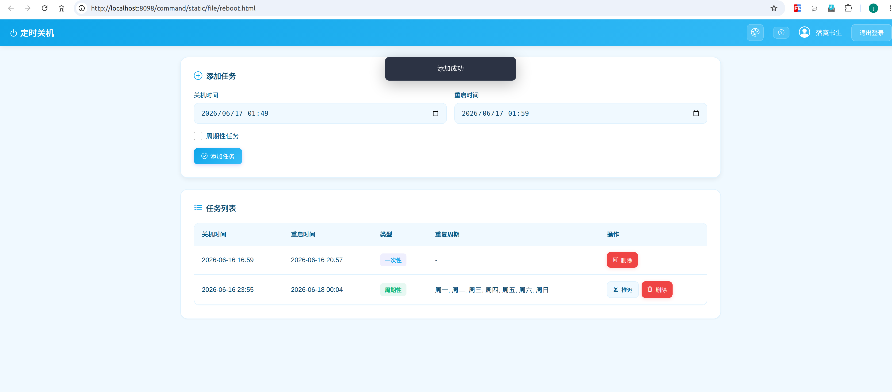

- **双模式任务**：
  - 一次性任务：执行一次后自动删除，适合临时维护和单次实验
  - 周期性任务：可指定工作日，到期后自动计算下一周期，适合每日定时关机/唤醒
- **任务管理**：查看所有已创建任务，包括执行时间、状态（待执行/执行中/已过期）及实时倒计时，支持删除或推迟执行。
- **到期预警**：任务距离执行时间不足 10 分钟时，页面顶部弹出倒计时警告卡片。

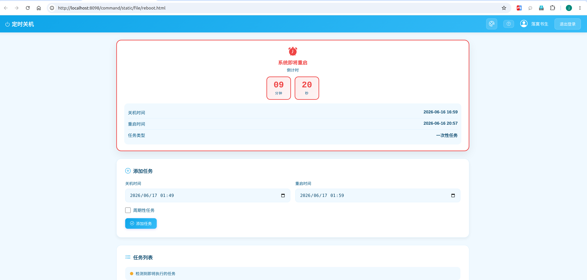

---

## 👥 用户角色说明

| 角色 | 权限级别 | 说明 | 可访问功能 |
| :--- | :--- | :--- | :--- |
| **管理员 (Admin)** | 最高 (Level 3) | 系统维护者 | 全部功能：文件管理、用户管理、模型管理、资源监控、定时关机、全局配置 |
| **普通用户 (User)** | 标准 (Level 2) | 正式注册用户 | 文件管理（受权限约束）、AI 聊天、个人设置；帐号具有有效期，到期自动封禁 |
| **访客 (Guest)** | 临时 (Level 1) | 自助注册账号 | 文件管理（受权限约束）、AI 聊天、个人设置；账号具有有效期，到期自动封禁 |

---

## 📖 部署文档

详细的部署流程、环境配置、模型管理、GPU 监控等完整操作指南，请参考项目目录下的 **PDF 文档**。

---

## 📂 资源下载

### GitHub Releases（推荐 ⭐）

**本仓库 Releases 发布的是全功能完全版（不设任何功能阉割）**，可直接从 GitHub Releases 列表中下载最新版本试用：
👉 **[前往 Releases 下载完全版](https://github.com/zhoujianguowei/local-llm-webui-management-hub/releases/latest)**

### 夸克网盘资源

所有必要资源已整合至夸克网盘，请按需下载：

- **基础环境 (JDK & llama.cpp 各平台版本)**: [点击下载](https://pan.quark.cn/s/24cf8a0d7419) | 提取码：`i2N2`
- **完全版部署包 (Full Version)**: [点击下载](https://pan.quark.cn/s/23228097c180) | 提取码：`D2Nd`
- **基础版部署包 (Base Version)**: [点击下载](https://pan.quark.cn/s/76596a20aeb1) | 提取码：`SDza`

---

## 🔒 离线授权机制与物理绑定

本系统完全版采用 **物理一机一码离线激活** 机制。系统运行期间 100% 纯离线，无需任何外网通信，核心代码经过高强度安全混淆加密，确保企业及个人内网环境下的绝对数据隐私。

系统的机器码由您的 **CPU、主板以及操作系统** 共同决定：
* **无忧硬件升级**：日常更换显卡、硬盘、内存或电源，**均不影响**系统的激活状态。
* **重置触发现象**：只有重新安装底层操作系统，或更换核心三大件（CPU/主板）时，才会导致机器码变更。

---

## 🎁 10天完全版免费体验（白嫖福利）

为了让各位极客老哥能够深度测试本系统在多卡张量并行、显存动态监控、定时开关机等硬核功能上的稳定性，**本仓库 Releases 发布的整合包即为全功能完全版（不设任何功能阉割）。**

下载并首次启动系统后，UI 界面会自动弹窗显示您的专属 **物理机器码**。您可以通过以下任一通用方式联系我，**免费获取 10 天完全版离线激活码**：

### 📬 途径一：邮件自助申请

* **接收邮箱**：`zhoujianguowei@gmail.com`
* **邮件主题**：申请完全版10天体验码
* **邮件正文**：附带您系统界面上显示的 **物理机器码** 即可。
* **回信时效**：我会在收到邮件的第一时间为您手动生成并回复授权码。

### 🛒 途径二：闲鱼联络通道

* 👉 **[点击此处跳转闲鱼：私有部署混合大模型管理系统]**(https://m.tb.cn/h.RyadbB4?tk=PijHgM4BYT6%20tG-#22>lD)
* **操作流程**：直接在闲鱼私聊发送暗号 **"完全版10天免费体验"**，并附带您的 **物理机器码**。

> 💡 **关于正式版完全版**：10 天试用期满后，如需继续使用或永久买断（永久全功能激活），请直接在闲鱼拍下对应商品，感谢支持独立开发者！
