# Hybrid LLM Management System

> ### 🌐 Language / 语言
> **English** | [**中文**](README_zh.md)

---

## 📋 System Overview

This system (Hybrid LLM Management System) is a comprehensive management platform for locally deployed large language models, integrating **file management, user permissions, model scheduling, AI chat, and system monitoring** into one secure, efficient, and user-friendly solution.

Built on Java + Spring Boot with Bootstrap 5 on the frontend, the system schedules local GGUF-formatted large language models through llama.cpp on the backend, while also supporting OpenAI-compatible remote API integration. Its core objective is to address cumbersome path permission management, model parameter configuration, and resource monitoring in local model deployments.

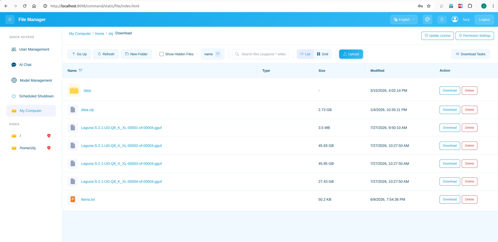

**Version Information**

| Version | Version Suffix | Description | Included Features |
| :--- | :--- | :--- | :--- |
| **Base Edition** | `release_base` | Minimal deployment version | Core features: file management, user management, AI chat, permission system |
| **Ultimate Edition** | `release_ultimate` | Full-featured version | All base features + model management, resource monitoring, scheduled shutdown/reboot, and more |

> ⚠️ **Multimodal Capability Note**: The current version's multimodal capabilities **only support image input**; audio and video input are not supported.
>
> ⚠️ **Scheduled Shutdown/Reboot Compatibility Note**: This feature relies on underlying operating system commands and hardware support; not all machines can run it properly. Tested systems: dual X99 (Ubuntu 22.04, E5-2696 v4) and Mac M1 Pro shutdown/reboot work normally; Windows 10 64-bit (z690 motherboard, i7-13700K) shutdown works, but automatic wake-up reboot is limited by motherboard BIOS and cannot be woken up in self-testing.
>
> ⚠️ **GPU Monitoring Compatibility Note**: GPU monitoring depends on the `nvidia-smi` tool and **only supports systems with NVIDIA GPUs**. macOS systems using Apple Silicon (M series) or integrated graphics have no corresponding monitoring interface, so no GPU monitoring panel is provided under macOS.

### Version History

| Version | Changes |
| ---- | :--- |
| v1.1 | 1. Ultimate Edition AI chat supports automatic detection of local models, no manual API configuration needed; thinking level can be selected at model startup or during conversation 2. Added English language support, with Chinese/English switching 3. Added more llama.cpp parameter support, including primary GPU, repeat-penalty, top-k, top-p, etc. 4. Fixed various bugs, including AI chat window abnormal closure prompts, path search popup height issues, etc. |
| v1.0 | Initial release with basic file management, AI chat, user management, model management, and scheduled shutdown/reboot features |

## Installation Instructions (Demonstrated on Windows)

### Official Test Environment Reference

- **OS**: Windows 10 64-bit / Ubuntu 22.04 LTS / macOS (M1 Pro)
- **CPU**: Intel i7-13700K / Dual Xeon E5-2696 v4
- **GPU**: NVIDIA RTX 2080 Ti (11GB/22GB Modified)
- **RAM**: 32GB / 128GB DDR4

### Windows Installation Demo

- Install JDK: [JDK 8 and above](https://www.oracle.com/java/technologies/downloads/#java8) (JDK 8 is recommended, tested across multiple platforms), and add the Java executable path to your system environment variables. On Linux or macOS, add the Java bin path to your PATH. 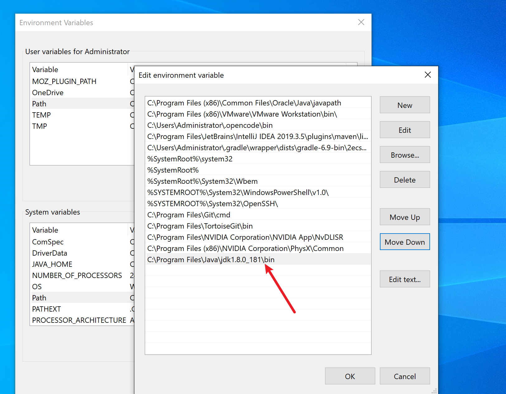

- Install [llama.cpp releases](https://github.com/ggml-org/llama.cpp/releases): Download and extract based on your platform. **For Windows systems with NVIDIA GPUs, you also need to download the corresponding cudart resources and place them in the extracted directory.** I'm currently using an NVIDIA GPU with CUDA 13.3, so download cudart 13.3. 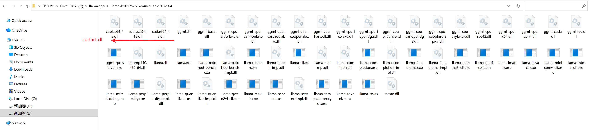

- Install the JAR package: Download the [latest compressed package](https://github.com/zhoujianguowei/local-llm-webui-management-hub/releases), extract it, then run the corresponding script. You can adjust JVM parameters as needed. 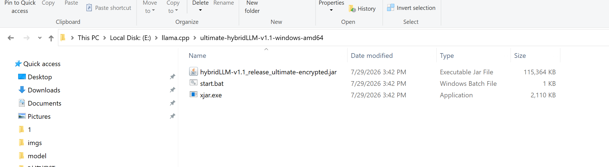

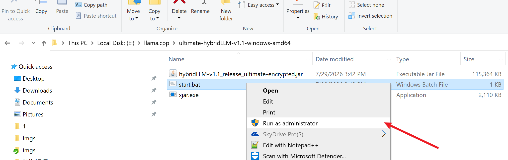

- Start and configure: After the JAR starts, open [http://localhost:8098/command/static/file/login.html](http://localhost:8098/command/static/file/login.html) in your browser. Default credentials are admin/admin. You must change your password after first login. 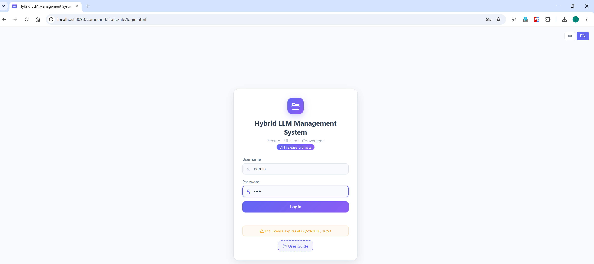

- After successful login, click **Update License** to update your machine's authorization code. **Click the question mark in the toolbar to view detailed usage guides and features.** 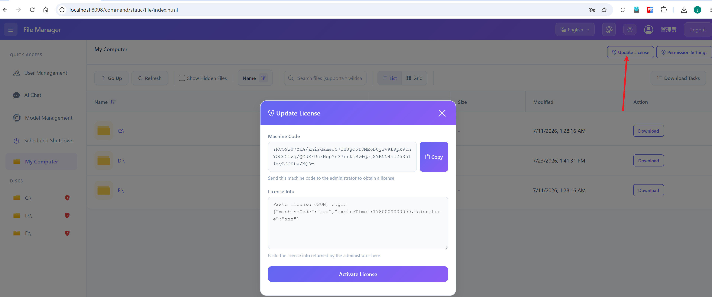

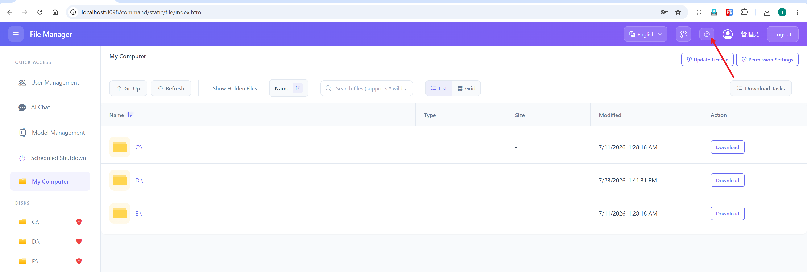

- Model management configuration: On first entry to the model management page, fill in the directory containing GGUF model files and the llama.cpp executable path. The system will automatically detect and list available models. The **Model Naming And Split Merge** button shows detailed GGUF directory and naming conventions, with automatic shard detection and merge support. 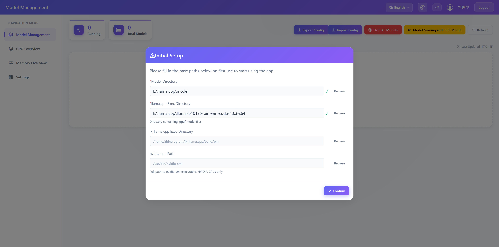

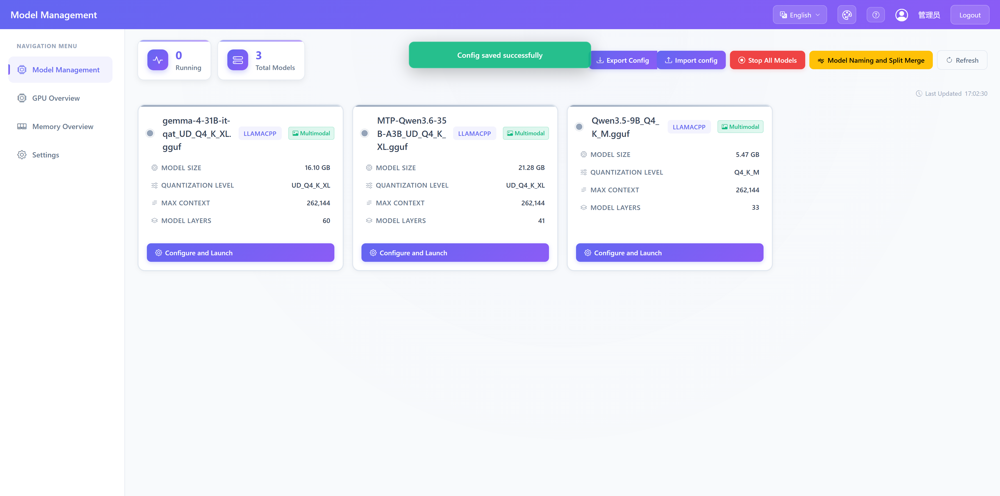

- Add the GPU nvidia-smi path: Use `where nvidia-smi` (Windows) or `which nvidia-smi` (Linux/macOS) to find the nvidia-smi system path, then add it in the model settings page. GPU information will be visible after configuration. 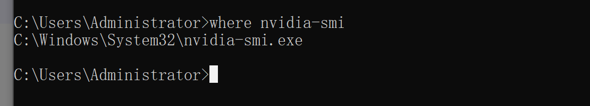

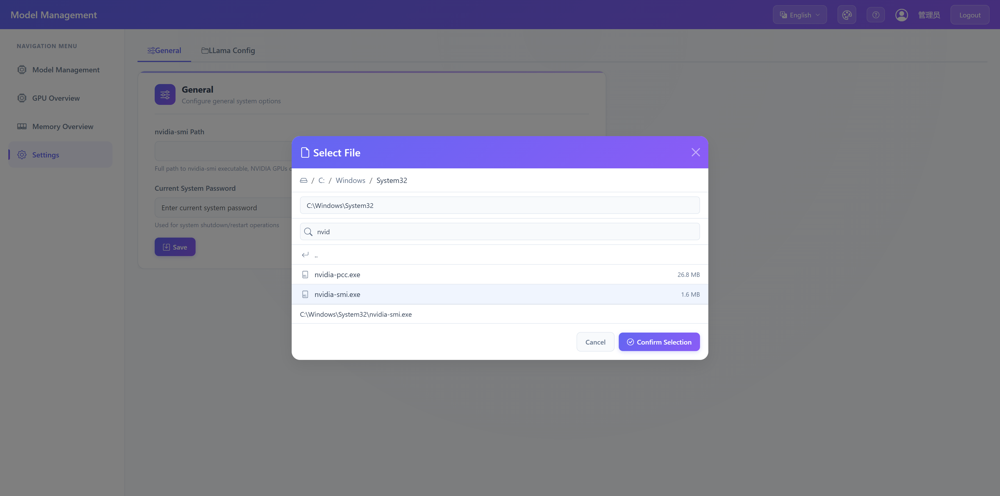

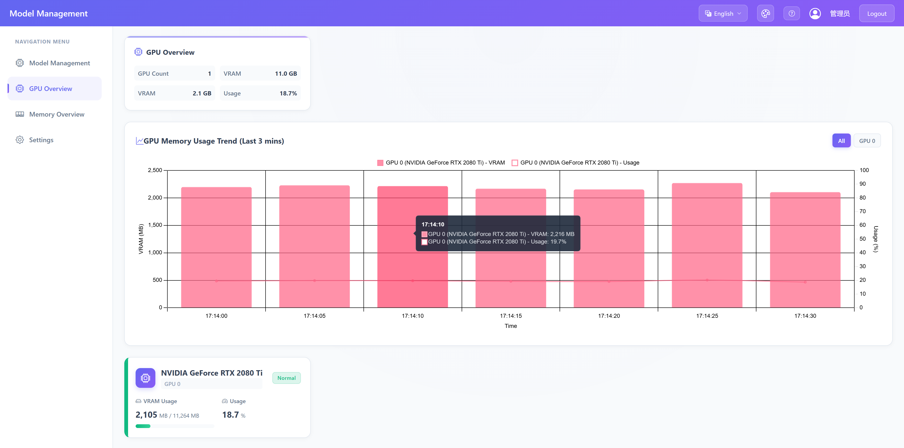

- Start the model 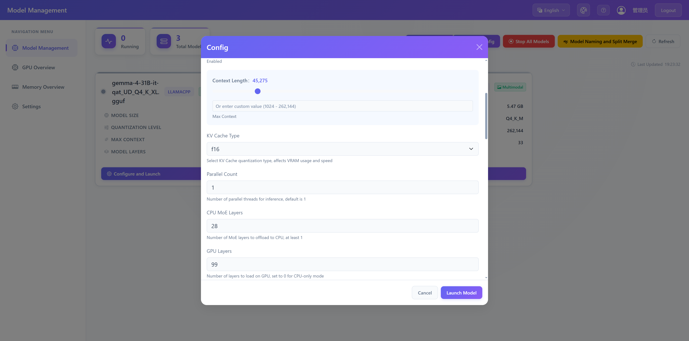

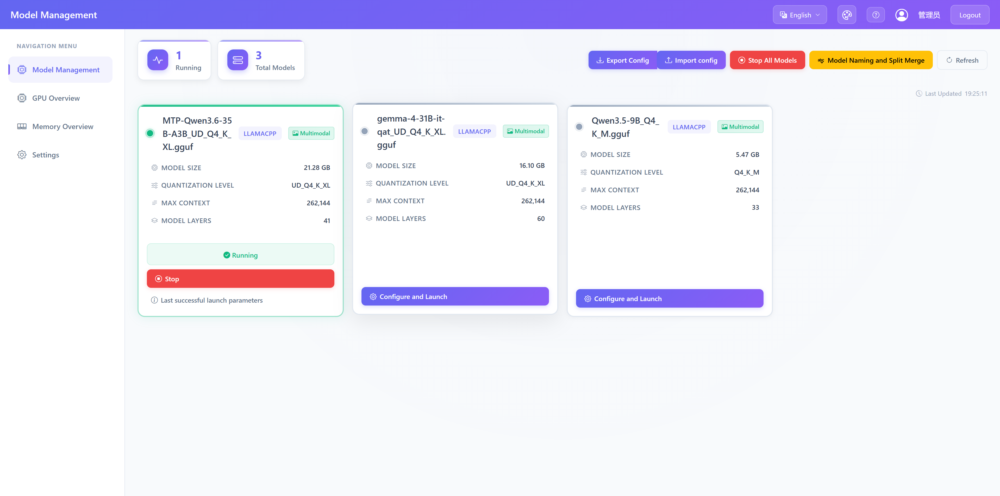

- AI Chat: **Ultimate Edition v1.1 and above supports automatic detection of locally deployed models, with no need to configure OpenAPI or model thinking level parameters. If using v1.0 or Base Edition, OpenAPI configuration is required.**

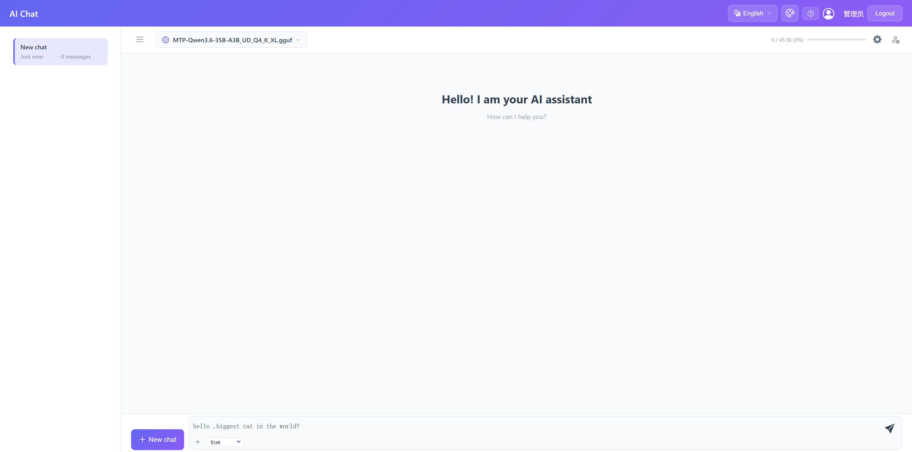

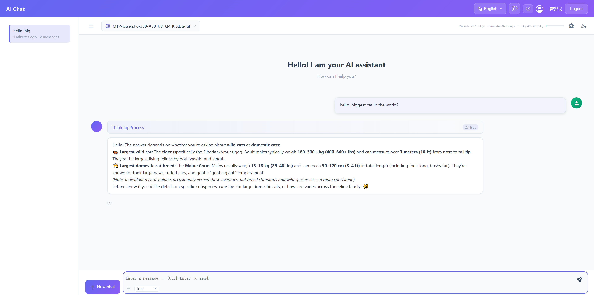

## 🌟 Core Feature Highlights

### 1. Minimal Deployment and Multi-Platform Compatibility

- **Zero Database Dependency**: No need to install MySQL/PostgreSQL or other databases; single JAR deployment, runs on startup.
- **Multi-Platform Support**: Compatible with **Windows**, **Linux (Ubuntu)**, and **macOS (Apple Silicon)**.
- **Fully Offline Operation**: Frontend resources are 100% localized, with no dependency on external CDNs, meeting high-security intranet requirements.
- **Thinking Mode Auto-Detection**: Supports automatic detection of thinking mode for GGUF files; thinking mode level can be specified at model startup or selected during AI chat.

### 2. File Management

- **Smart Upload**: Supports drag-and-drop file upload and chunked upload for large files, with real-time progress display for each chunk and overall percentage in the right task bar.

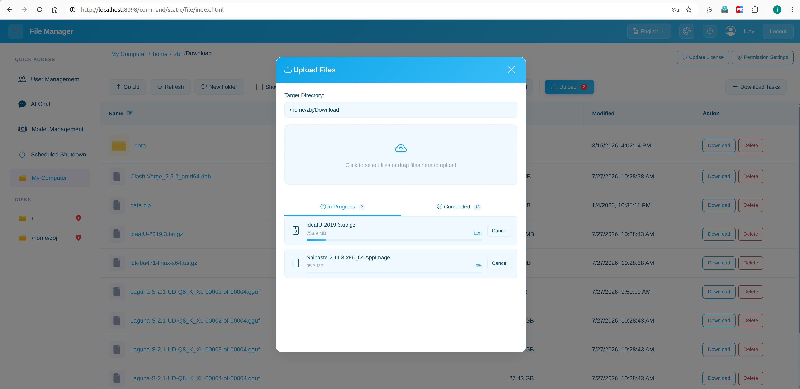

- **Flexible Download**: Supports file or folder download; individual files download directly, while folders are automatically packaged into `.zip` archives in the background, with completion status viewable in the download task list.
- **Multimedia Preview**: Supports preview of multiple multimedia formats without download.
  - Images (JPG, PNG): Full-screen view support
  - Video: Range request support, freely draggable progress bar
  - Documents (PDF): Online preview support
  - Text/Code: Preview support for common text formats including TXT, Java, Python, JS, HTML, JSON, YAML, etc.
- **Search**: Supports fuzzy filename matching with wildcard support (e.g., `*.py`) for quick filtering of specific file types.
- **View Switching**: Toggle between list view (detailed properties) and tile view (suitable for image browsing).
- **Secure Deletion**: Deletion requires double confirmation, strict `DELETE` permission validation, and protected paths cannot be deleted even by administrators.

### 3. Fine-Grained Permission System

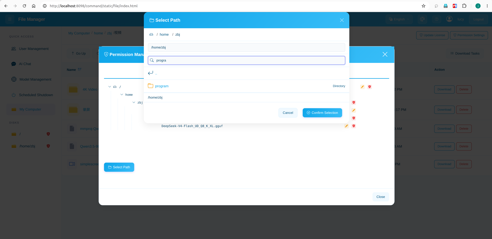

- **Path Inheritance Mechanism**: When accessing files without set rules, the system automatically traces upward to the parent directory until the nearest matching rule is found.

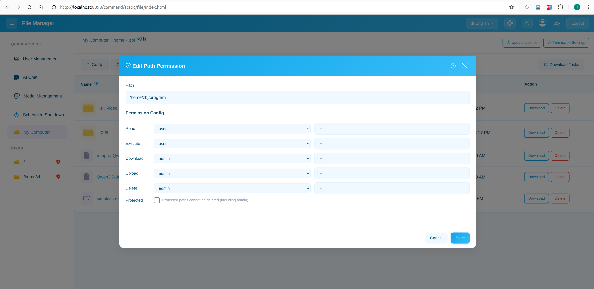

- **Permission Cascade (Priority)**: **Delete > Upload > Download > Execute > Read**; higher-level permissions automatically include lower-level permissions.
- **Dual Role and User Validation**: Each permission can configure minimum allowed role, with support for specific authorized user lists.
- **Path Penetration**: Even without parent directory execution permissions, files with read permissions at deeper levels can be accessed directly.
- **Permission Tree Management**: Visual tree structure for intuitive viewing of system-wide permission distribution, with quick location and modification of specific subdirectory permissions.
- **Path Protection Mechanism**: Protected paths display special identifiers in the file management interface, with all deletion requests directly intercepted.

### 4. Full User Lifecycle Management

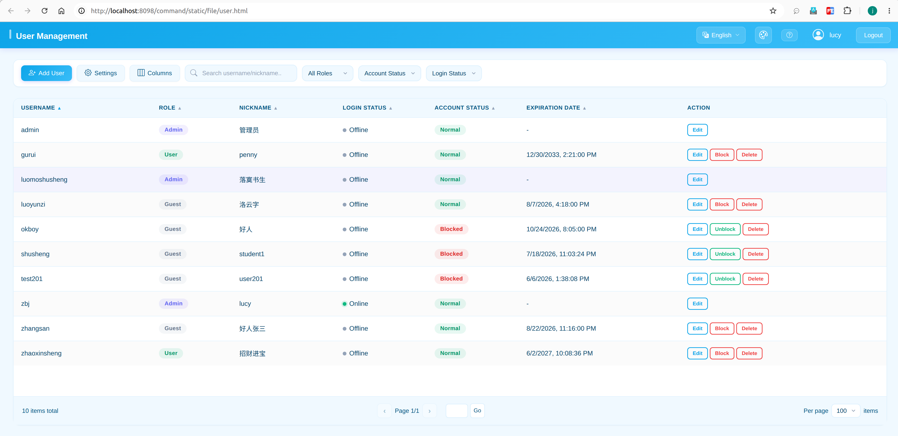

- **Role Management**: Supports three roles — Admin, User, and Guest — switchable at any time.
- **Status Control**: One-click ban/unban; banned users trigger an unban request process upon login, which administrators can handle in real time.
- **Guest Expiry**: Configurable default validity period (in days) for guest accounts; the system periodically scans for expired accounts and automatically bans them.
- **Self-Registration**: When guest registration is enabled, users can self-register on the login page, with accounts automatically receiving preset validity periods.

### 5. Intelligent AI Chat

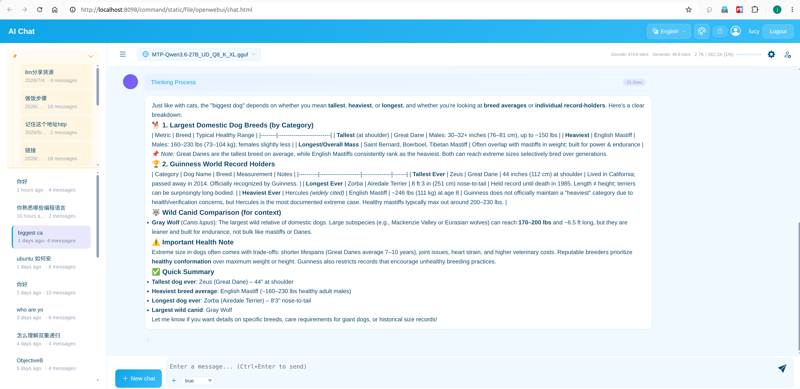

- **Conversation Management**: Supports new conversations, loading history, deleting sessions, renaming, and pinning frequently used conversations.
- **Multi-Method Attachment Upload**:
  - Image Upload: AI can recognize text content within images
  - Text File Upload: Supports common text types including `.txt`, `.java`, `.py`, `.js`, `.bat`, `.sh`, etc.

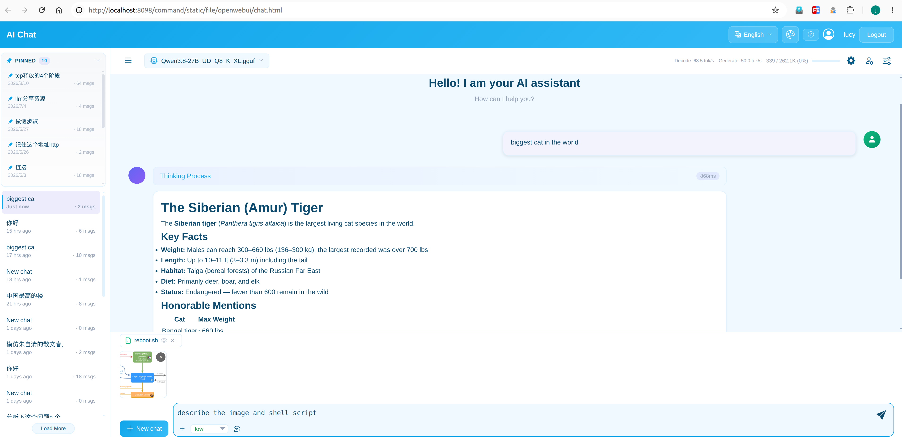

  - Folder Upload: Supports uploading entire directory listings. If the model supports image input, image files are included; otherwise, only plain text files are included.

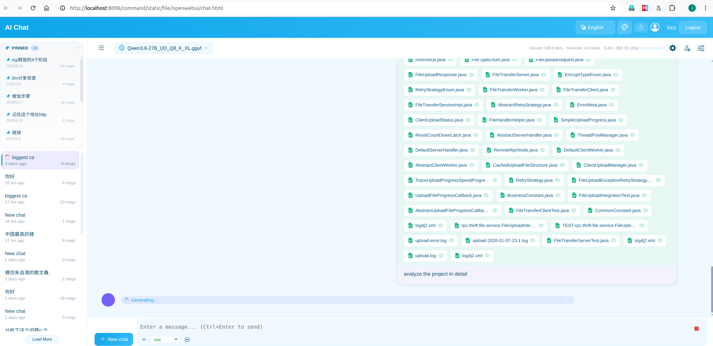

  - Paste File Path: Paste paths into the input box for automatic recognition and upload
  - Copy File Paste: Copy files from a file manager or IDE and paste directly into the chat input box

- **Code Generation**: AI-generated code blocks support one-click copy, save as local file, and collapsible display for long code.
- **Deep Thinking Mode**: Supports deep thinking functionality for models such as qwen3.5, qwen3.6, gemma4, deepseek-v4-flash, hy3, etc.
- **System-Level Configuration**: Administrators can configure OpenAPI integration, model capability definitions (regex matching to enable/disable thinking mode), and per-role limits on attachment size and maximum message count.
- **Conversation Statistics**: Real-time display of prompt prefill speed, decode speed, current conversation context ratio, and other performance metrics.

### 6. Deep Integration with llama.cpp Inference Engine
 **Also supports adding ik_llama.cpp as an inference engine (optional)**. If this path is configured, model startup supports selecting between llama.cpp and ik_llama.cpp inference engines. (GGUF auto-sharding still uses llama.cpp at the underlying level; for ik_llama.cpp sharding, manual merging may be required.)

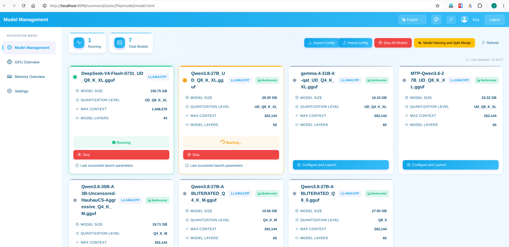

- **Multi-GPU Parallel Acceleration**: Full support for llama.cpp's **SM Tensor** scheduling for multi-GPU parallel inference.
- **MTP Prediction Acceleration**: Supports **Multi-Token Prediction** to significantly reduce inference steps.
- **Multiple Quantization Format Support**: Supports F32/BF16/F16Q8_0/Q8_K, Q6_K, Q5_K_M, Q4_K_M, IQ3_XXS, and other common quantization types.
- **GGUF Automated Management**:
  - Automatic detection of sharded files (e.g., `model-00001-of-00002.gguf`) with one-click merge
  - Built-in naming convention checks to ensure uniform model file naming (format: `model_name_quantization_type.gguf`)
  - Automatic matching of `mmproj` multimodal projection files and `mtp` Draft model files
- **Fine-Grained Startup Parameters**: Supports 18+ parameter tuning including context size, GPU load layers, parallel task count, tensor splitting, KV Cache quantization, temperature, thread count, batch size, and more.

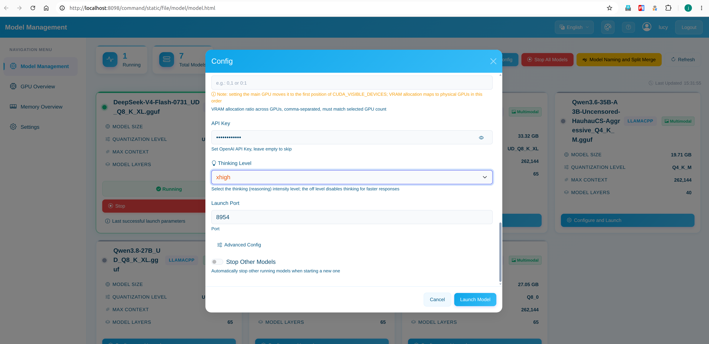

### 7. Real-Time Resource Monitoring

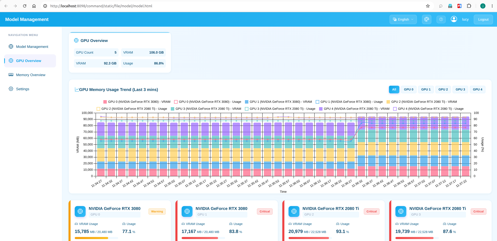

- **GPU Monitoring**: Integrated `nvidia-smi` real-time parsing, data synchronized every 10 seconds, recording trend charts of the last 60 samples for intuitive viewing of each GPU's type and memory usage.

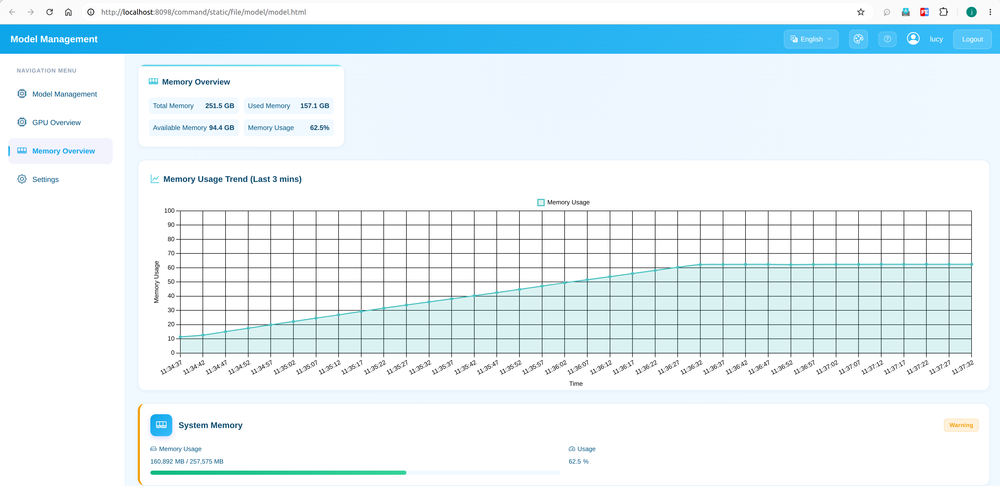

- **Memory Monitoring**: Real-time display of total memory, used memory, available memory, and overall usage percentage, with a 3-minute memory usage fluctuation curve to help analyze memory peaks during model loading.

### 8. Intelligent Scheduled Reboot

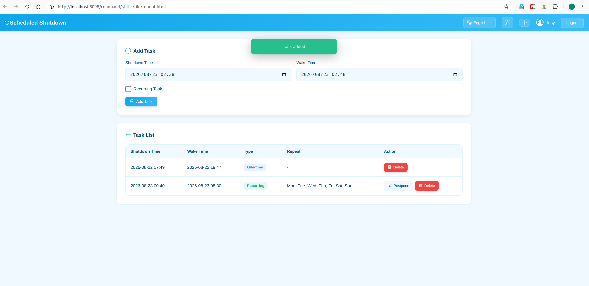

- **Dual-Mode Tasks**:
  - One-Time Tasks: Automatically deleted after execution, suitable for temporary maintenance and single experiments
  - Periodic Tasks: Configurable workdays with automatic next-cycle calculation upon expiry, suitable for daily scheduled shutdown/wake
- **Task Management**: View all created tasks including execution time, status (pending/running/expired), and real-time countdown, with support for deletion or delay.
- **Expiry Warning**: When a task is less than 10 minutes from execution, a countdown warning card pops up at the top of the page.

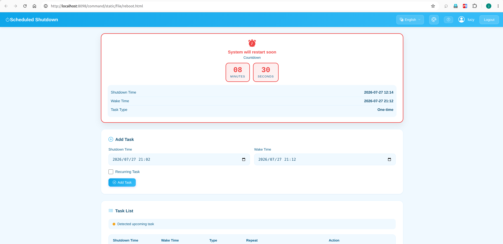

---

## 👥 User Role Description

| Role | Permission Level | Description | Accessible Features |
| :--- | :--- | :--- | :--- |
| **Admin** | Highest (Level 3) | System Maintainer | All features: file management, user management, model management, resource monitoring, scheduled shutdown, global configuration |
| **User** | Standard (Level 2) | Registered User | File management (permission-restricted), AI chat, personal settings; accounts have expiry dates with automatic ban upon expiry |
| **Guest** | Temporary (Level 1) | Self-Registered Account | File management (permission-restricted), AI chat, personal settings; accounts have expiry dates with automatic ban upon expiry |

---

## 🔒 Offline Authorization and Physical Binding

The Ultimate Edition uses a **one-machine-one-code offline activation** mechanism. The system runs 100% offline during operation, requiring no external network communication. Core code is protected with high-intensity security obfuscation and encryption, ensuring absolute data privacy in enterprise and personal intranet environments.

The system's machine code is determined by your **CPU, motherboard, and operating system**:
* **Worry-Free Hardware Upgrades**: Routine upgrades of GPU, hard drive, RAM, or power supply **do not affect** the system's activation status.
* **Reset Triggers**: Machine code changes only occur when reinstalling the underlying operating system or replacing core components (CPU/motherboard).

---

### 🛒 How to Obtain a Lifetime License?

All release packages come with a built-in **30-day full-feature free trial (Ultimate Edition Trial)**. After the trial period expires, if you wish to purchase the lifetime version, please pay through the dedicated channels below.

*Please fill in your **Machine UUID** and **email address to receive the license code** in the **Notes/Reference** field on the Wise payment page.*
*(If you forget to fill them in at the time of payment, please send the payment receipt screenshot along with your machine code to `zhoujianguowei@gmail.com`. The license code will be manually issued within 24 hours.)*

| Software Version | Lifetime Price | Offline Payment Link |
| :--- | :--- | :--- |
| 📦 **Base Edition** | **$9** / Lifetime | [Purchase via Wise](https://wise.com/pay/r/gm5d-VpLW7MCSEw) |
| 👑 **Ultimate Edition** | **$19** / Lifetime | [Purchase via Wise](https://wise.com/pay/r/O6Dof1HeszgCgZA) |
