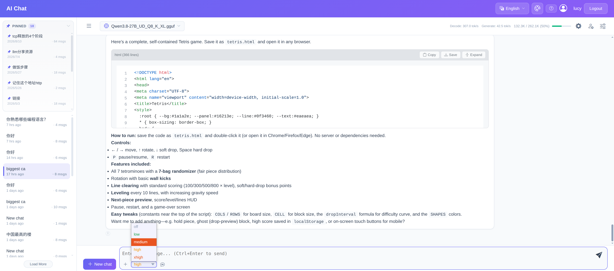
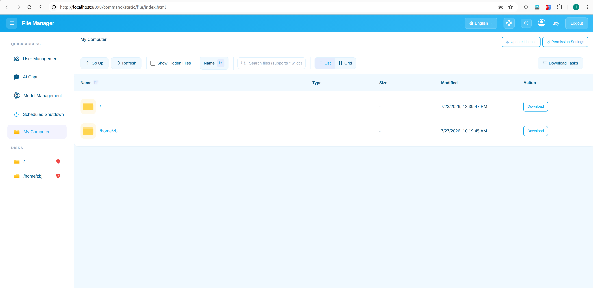

# 混合大模型一站式管理系统 (Hybrid LLM Management System)

> ### 🌐 Language / 语言
> [**English**](README.md) | **中文**

**📖 目录**

- [📋 项目简介](#-项目简介)
- [🌟 功能详情](#-功能详情)
- [🏷️ 版本信息](#-版本信息)
- [⚠️ 兼容性与已知限制](#-兼容性与已知限制)
- [🚀 快速开始](#-快速开始)
- [🛠️ 安装说明](#-安装说明)
- [👥 用户角色说明](#-用户角色说明)
- [🔒 离线授权机制与物理绑定](#-离线授权机制与物理绑定)
- [❓ 常见问题 (FAQ)](#-常见问题-faq)
- [📮 联系方式与支持](#-联系方式与支持)

---

## 📋 项目简介

本系统（混合大模型管理系统 / Hybrid LLM Management System）是一套面向本地部署大语言模型的综合管理平台，集 **文件管理、用户权限、模型调度、AI 对话、系统监控** 于一体，提供安全、高效、便捷的一站式操作体验。

系统基于 **Java + Spring Boot** 构建（前端采用 Bootstrap 5），后端通过 **llama.cpp** 调度本地 GGUF 格式的大语言模型，同时支持 **OpenAI 兼容**的远程 API 接入。其核心目标是解决本地模型部署中繁琐的路径权限管理、模型参数配置以及资源监控问题。

### ✨ 亮点特性

| 特性 | 说明 |
| :--- | :--- |
| 🔥 **思考模式自动检测** | 通过识别 GGUF 文件内置的 Jinja 模板，自动检测模型是否支持思考模式，启动时与对话运行时均可灵活选择思考等级，无需手动配置。已验证支持：unsloth 量化的 qwen3.8 系列、gemma4、hy3、deepseek-v4-flash-0731、inkling-small、minimax-m3 等常见开源模型 |
| ⚡ **深度集成 llama.cpp** | 全面支持多 GPU 并行加速（SM Tensor）与预测推理（Speculative Decoding）加速，涵盖 MTP (Multi-Token Prediction)、DFlash、DSpark 三种类型，显著提升大模型推理的吞吐量与响应速度 |
| 🔒 **完全离线，开箱即用** | 前端资源 100% 本地化，不依赖任何外网 CDN，确保在极高安全要求的内网环境下依然能够流畅运行 |
| 🚀 **零配置部署 & 跨平台** | 全面兼容 Windows、Linux、macOS 三大主流平台；无需安装与配置数据库，采用单 Jar 包部署模式，真正实现"启动即运行" |
| 🛡️ **细粒度路径权限** | 基于路径继承的权限校验机制，涵盖读取、执行、上传、下载、删除五类核心权限，支持角色最小权限限制及特定用户额外授权，确保私有数据的绝对安全 |
| 📂 **项目级 AI 代码分析** | 支持文件批量上传并自动提取文本内容，可将整个源代码目录中的关键文件一次性提交给 AI，实现跨文件的项目级代码分析与重构建议 |
| ⚙️ **GGUF 自动化生命周期管理** | 自动识别 GGUF 分片文件并支持一键合并，内置严格的命名规范检查，确保模型文件统一且易于检索调度 |
| 📊 **实时资源监控面板** | 集成 `nvidia-smi` 实现毫秒级实时监控，提供 GPU 显存使用率和系统内存的动态趋势图表，帮助管理员在启动模型前精准评估资源可用性 |
| ⏰ **智能定时开关机** | 支持一次性及周期性（按工作日）定时关机/唤醒任务，内置任务冲突检测与到期预警，是无人值守服务器环境的理想选择 |

---

## 🌟 功能详情

### 1. 深度集成 llama.cpp 推理引擎

**可选集成 ik_llama.cpp 作为推理引擎（非必填）**：配置该路径后，启动模型时可在 llama.cpp 与 ik_llama.cpp 两种推理引擎之间切换。ik_llama.cpp 分支在并发处理和部分量化模型加速方面表现更佳，为追求极致性能的用户提供了额外的灵活度。（注：GGUF 自动分片合并底层仍基于 llama.cpp，ik_llama.cpp 产生的分片需要手动合并。）

- **多 GPU 并行加速**：全面支持 llama.cpp 的 **SM Tensor** 调度，实现多卡并行推理。
- **MTP 预测加速**：支持 **Multi-Token Prediction** 多 Token 预测，涵盖 DSpark、DFlash、MTP，显著减少推理步数。
- **多种量化格式支持**：支持 F32/BF16/F16Q8_0/Q8_0、Q6_K、Q5_K_M、Q4_K_M、IQ3_XXS 等常见量化类型。
- **GGUF 自动化管理**：
  - 自动识别分片文件（如 `model-00001-of-00002.gguf`）并一键合并
  - 内置命名规范检查，确保模型文件命名统一（格式：`模型名_量化类型.gguf`）
  - 自动匹配 `mmproj` 多模态投影文件和 `mtp` Draft 模型文件
- **精细化启动参数**：支持上下文大小、GPU 加载层数、并行任务数、张量分割、KV Cache 量化、温度、线程数、批处理大小等 18+ 参数调优。

### 2. 智能 AI 对话

- **对话管理**：支持新建对话、加载历史、删除会话、重命名、置顶常用会话。
- **多方式附件上传**：
  - 文件上传：支持复制文件路径方式上传，也支持剪切板拷贝的图片上传，支持常见文本格式和图片格式
    
  - 文件夹上传：支持整个文件目录列表上传。若模型支持图片输入则包含图片文件，否则仅包含纯文本文件
    

- **代码生成**：AI 生成的代码块支持一键复制、保存为本地文件，长代码支持折叠显示。
- **深度思考模式**：支持 qwen3.5、qwen3.6、gemma4、deepseek-v4-flash、hy3 等模型的深度思考功能。
- **系统级配置**：管理员可配置 OpenAI API 接入、模型功能定义（正则匹配开启/关闭思考模式）、按角色限制附件大小和最大消息数。
- **对话统计**：实时显示 prompt prefill 速度、decode 速度、当前对话上下文占比等性能指标。

### 3. 文件管理

- **智能上传**：支持文件拖拽上传和大文件分片上传，右侧任务栏实时显示每个分片的上传进度和整体百分比。

- **灵活下载**：支持文件或文件夹下载。单个文件直接下载，文件夹自动在后台打包为 `.zip` 压缩包，可在下载任务列表中查看压缩进度。
- **多媒体预览**：支持多种格式在线预览，无需下载即可查看内容。
  - 图片 (JPG, PNG)：支持全屏查看
  - 视频：支持 Range 请求，可随意拖动进度条
  - 文档 (PDF)：支持在线预览
  - 文本/代码：支持 TXT、Java、Python、JS、HTML、JSON、YAML 等常见文本格式预览
- **搜索**：支持文件名模糊匹配，可使用通配符（如 `*.py`）快速筛选特定类型文件。
- **视图切换**：支持列表视图（显示详细属性）与平铺视图（适合图片浏览）切换。
- **安全删除**：删除操作需二次确认，严格校验 `DELETE` 权限，受保护路径即使管理员也无法删除。

### 4. 细粒度权限体系

- **路径继承机制**：访问文件时若未设置规则，系统自动向上追溯至父目录，直到找到最近匹配规则。

- **权限级联 (优先级)**：**删除 > 上传 > 下载 > 执行 > 读取**，高级权限自动包含低级权限。
- **角色与用户双重校验**：每项权限可配置最小允许角色，同时支持添加特定授权用户名单。
- **路径穿透 (Path Penetration)**：即使没有父目录执行权限，只要拥有深层文件的读取权限即可直接访问。
- **权限树管理**：可视化树形结构，直观查看整个系统的权限分布，快速定位并修改特定子目录权限。
- **路径保护机制**：受保护路径在文件管理界面显示特殊标识，所有删除请求直接拦截。

### 5. 用户全生命周期管理

- **角色管理**：支持管理员 (Admin)、普通用户 (User)、访客 (Guest) 三种角色，可随时切换。
- **状态控制**：一键封禁/解封，被封禁用户登录时触发解封申请流程，管理员可实时处理。
- **访客有效期**：可配置访客账号默认有效期（天数），系统定期扫描过期账号并自动封禁。
- **自助注册**：开启访客注册后，用户可在登录页自助注册，账号自动获得预设有效期。

### 6. 实时资源监控

- **GPU 监控**：集成 `nvidia-smi` 实时解析，每 10 秒同步一次数据，记录最近 60 个样本的趋势图，直观查看每张显卡类型和显存占用。

- **内存监控**：实时显示总内存、已用内存、可用内存及整体使用率百分比，绘制近 3 分钟内存使用波动曲线，帮助分析模型加载时的内存峰值。

### 7. 智能定时重启

- **双模式任务**：
  - 一次性任务：执行一次后自动删除，适合临时维护和单次实验
  - 周期性任务：可指定工作日，到期后自动计算下一周期，适合每日定时关机/唤醒
- **任务管理**：查看所有已创建任务，包括执行时间、状态（待执行/执行中/已过期）及实时倒计时，支持删除或推迟执行。
- **到期预警**：任务距离执行时间不足 10 分钟时，页面顶部弹出倒计时警告卡片。

---

## 🏷️ 版本信息

### 版本说明

| 版本 | 版本号后缀 | 说明 | 包含功能 |
| :--- | :--- | :--- | :--- |
| **基础版** | `release_base` | 精简部署版本 | 文件管理、用户管理、AI 聊天、权限体系等核心功能 |
| **完全版** | `release_ultimate` | 全功能版本 | 基础版全部功能 + 模型管理、资源监控、定时开关机等高级功能 |

### 版本历史变更

| 版本 | 变更内容 |
| :--- | :--- |
| **v1.12** | 1. 新增 llama.cpp Speculative Decoding（预测推理）支持，涵盖 DSpark、DFlash、MTP 三种类型，并支持设置 n-max 和 p-min 参数 2. AI 对话功能增强：支持 Markdown 语法高亮、OpenAI 请求携带思考内容开关，以及运行时动态修改 temperature、top-p 等参数 3. OpenAI 请求兼容性增强：由仅支持 llama.cpp 扩展至支持 Ollama、kTransformer、sglang 等主流推理引擎（非 llama.cpp 引擎暂不支持查看 decode/prefill 速度等详细数据） 4. 修复文件列表上传、AI 对话特殊字符转义错误等已知问题 |
| **v1.11** | 1. 修复模型思考模式自动检测 bug，新增 inkling-small、minimax-m3 以及 deepseek-v4-flash-0731 模型的思考模式自动检测 2. 修复模型参数导入 bug、AI 对话页面代码渲染问题 3. AI 对话页面 UI 显示优化 |
| **v1.1** | 1. 完全版 AI 对话支持本地模型自动检测，无需手动配置 API，支持模型启动时或对话运行时选择思考等级，已自测验证 unsloth 的 qwen3.6、gemma4、deepseek-v4-flash 以及 hy3 等模型 2. 新增英语语言支持，界面支持中/英切换 3. 增加更多 llama.cpp 参数支持，包括主 GPU、repeat-penalty、top-k、top-p 等参数 4. 修复部分 bug，包括 AI 对话窗口异常关闭提示、路径搜索弹窗高度异常等问题 |
| **v1.0** | 首个发布版本，实现文件管理、AI 对话、用户管理、模型管理、定时开关机等基础功能 |

> 💡 上表仅列出主要版本变更，完整更新记录请见 [Releases](https://github.com/zhoujianguowei/hybrid-llm-management-system/releases)。

---

## ⚠️ 兼容性与已知限制

| 项目 | 说明 |
| :--- | :--- |
| **多模态能力** | 当前版本多模态能力 **仅支持图片输入**，不支持音频和视频输入。 |
| **定时关机/重启** | 该功能依赖于底层操作系统的指令集及硬件支持，并非所有机型均能正常运行。已测试环境：双路 X99 (Ubuntu 22.04, E5-2696 v4) 和 Mac M1 Pro 关机/重启均正常；Windows 10 64位 (z690 主板, i7-13700K) 关机功能正常，但自动唤醒重启受主板 BIOS 限制，自测无法唤醒。 |
| **GPU 监控** | GPU 监控功能依赖 `nvidia-smi` 工具，**仅支持搭载 NVIDIA 显卡的系统**。macOS 系统使用 Apple Silicon (M 系列) 或集成显卡，无对应监控接口，因此 macOS 下不提供 GPU 监控面板（内存监控不受影响）。 |

---

## 🚀 快速开始

1. **准备环境**：安装 JDK 8 及以上版本，并下载 [llama.cpp](https://github.com/ggml-org/llama.cpp/releases) 可执行文件（详见 [安装说明](#-安装说明)）。
2. **下载运行**：下载[最新发布包](https://github.com/zhoujianguowei/hybrid-llm-management-system/releases)，解压后运行对应平台的启动脚本即可。
3. **登录配置**：浏览器打开 [http://localhost:8098/command/static/file/login.html](http://localhost:8098/command/static/file/login.html)，初始账号密码为 `admin` / `admin`，首次登录成功后请修改账号密码。

---

## 🛠️ 安装说明

> 以下以 **Windows 系统**为例演示完整安装流程，Linux / macOS 操作类似。

### 官方测试环境参考

- **OS**: Windows 10 64-bit / Ubuntu 22.04 LTS / macOS (M1 Pro)
- **CPU**: Intel i7-13700K / Dual Xeon E5-2696 v4
- **GPU**: NVIDIA RTX 2080 Ti (11GB/22GB Modified)
- **RAM**: 32GB / 128GB DDR4

### 安装步骤（Windows 演示）

**1. 安装 JDK**

安装 [JDK 8 及以上版本](https://www.oracle.com/java/technologies/downloads/#java8)（推荐 JDK 8，该版本经过多平台测试），并将 Java 可执行路径添加到系统环境变量。Linux 或 macOS 系统需要将 java bin 路径添加到 PATH 中。

**2. 安装 llama.cpp**

下载并解压 [llama.cpp releases](https://github.com/ggml-org/llama.cpp/releases)（按自身平台选择）。**对于 NVIDIA 显卡的 Windows 系统，还需要下载对应的 cudart 资源，并放入解压后的目录中**（例如 CUDA 版本为 13.3 则下载 cudart 13.3）。

**3. 下载并解压发布包**

下载[最新版本的压缩包文件](https://github.com/zhoujianguowei/hybrid-llm-management-system/releases)，解压后运行对应的启动脚本即可，可根据需要调整 JVM 参数。

**4. 启动服务并完成基础配置**

Jar 包启动完成后，浏览器打开 [http://localhost:8098/command/static/file/login.html](http://localhost:8098/command/static/file/login.html)。初始账号密码为 `admin` / `admin`，首次登录成功后需要修改账号密码。

**5. 更新授权与查看指南**

登录成功后，可点击 **更新授权** 按钮更新本机授权码；工具栏页面的问号按钮可查看详细的使用指南以及功能说明。

**6. 配置模型管理**

首次进入模型管理页面，需要填写模型 GGUF 文件所在目录以及 llama.cpp 执行文件所在目录，填写完成后系统会自动识别出模型列表。**模型命名与分片合并** 按钮可查看详细的 GGUF 文件目录及命名规范，同时支持 GGUF 分片自动检测合并。

**7. 配置 GPU 监控（可选，仅 NVIDIA 显卡）**

使用 `where nvidia-smi` (Windows) 或 `which nvidia-smi` (Linux/macOS) 查看 `nvidia-smi` 所在系统路径，并添加到模型设置页面，添加完成后即可查看 GPU 信息。

**8. 启动模型**

**9. 开始 AI 对话**

**v1.1 及以上版本的完全版支持本地部署模型自动检测，无需配置 OpenAI API 和模型思考等级参数；若使用 v1.0 或基础版则需要配置 OpenAI API。**

---

## 👥 用户角色说明

| 角色 | 权限级别 | 说明 | 可访问功能 |
| :--- | :--- | :--- | :--- |
| **管理员 (Admin)** | 最高 (Level 3) | 系统维护者 | 全部功能：文件管理、用户管理、模型管理、资源监控、定时关机、全局配置 |
| **普通用户 (User)** | 标准 (Level 2) | 正式注册用户 | 文件管理（受权限约束）、AI 聊天、个人设置；账号具有有效期，到期自动封禁 |
| **访客 (Guest)** | 临时 (Level 1) | 自助注册账号 | 文件管理（受权限约束）、AI 聊天、个人设置；账号具有有效期，到期自动封禁 |

---

## 🔒 离线授权机制与物理绑定

本系统（完全版）采用 **纯离线一机一码物理绑定** 激活机制。系统运行期间 100% 隔离外部网络，无任何数据上传或后门依赖，核心组件经过工业级深度混淆加密，确保您的私有资产与代码上下文绝对安全。

**机器码判定逻辑：**

- 系统的物理特征码由您的 **CPU、主板与操作系统** 共同计算生成。
- **无忧硬件升级**：日常热插拔或更换**显卡、硬盘、内存、电源**等外设，**均不会**导致授权失效。
- **重新激活触发条件**：仅在重新安装底层操作系统，或彻底更换核心三大件（CPU/主板）时，机器码才会发生变更。

**版本兼容性说明：**

- **基础版与完全版授权不可串用**：基础版授权仅适用于基础版，完全版授权仅适用于完全版。
- **同一大版本授权可复用**：相同大版本系列内的授权码可互相复用。例如 v3.1、v3.2、v3.53 等同属 v3 系列的授权码可通用。
- **小版本无忧升级**：对于使用过程中遇到的阻塞性 bug 修复或小幅优化，将采用小版本升级方式发布，用户可无忧升级，原有授权持续有效。
- **高版本授权向下兼容低版本**：高版本授权可兼容低版本。例如完全版 v3.53 授权可向下兼容 v3.1、v3.2 以及 v2、v1 系列所有版本。
- **低版本授权不可用于高版本**：例如 v1 系列授权码无法在 v2、v3 系列上使用。

### 🛒 如何获取终身授权

所有发布包均默认内置 **30 天完全功能免费试用 (Ultimate Edition Trial)**。试用期满后如需购买终身买断版，请通过以下专属渠道支付。

> **🔒 隐私保证**：授权全程离线激活，授权码完全基于您的硬件哈希生成，系统绝不收集任何分析数据、遥测信息或用户隐私数据，请放心使用。

*请在 Wise 付款页面的 **备注/备忘录 (Notes/Reference)** 中填写您的 **本机机器码 (Machine Code)** 以及 **接收授权码的电子邮箱**。*
*(如支付时漏填，请直接将付款凭证截图与机器码发送至：`zhoujianguowei@gmail.com`，授权码将在 24 小时内完成人工签发。)*

| 软件版本 | 终身买断价格 | 离线支付链接 |
| :--- | :--- | :--- |
| 📦 **基础版 (Base Edition)** | **$9** / 终身 | [点击通过 Wise 购买](https://wise.com/pay/r/qhiUGbWu4ZlYoAI) |
| 👑 **完全版 (Ultimate Edition)** | **$19** / 终身 | [点击通过 Wise 购买](https://wise.com/pay/r/-5LpLO3Vcn6x4Cc) |

---

## ❓ 常见问题 (FAQ)

**Q：基础版和完全版有什么区别？**

A：基础版为精简部署版本，包含文件管理、用户管理、AI 聊天、权限体系等核心功能；完全版在基础版之上增加模型管理、资源监控、定时开关机等高级功能。两者授权不可串用，详见 [版本说明](#版本说明)。

**Q：macOS 为什么没有 GPU 监控面板？**

A：GPU 监控依赖 `nvidia-smi` 工具，仅支持搭载 NVIDIA 显卡的系统。macOS 使用 Apple Silicon (M 系列) 或集成显卡，无对应监控接口，因此 macOS 下不提供 GPU 监控面板（内存监控不受影响）。

**Q：Windows 下定时关机后无法自动唤醒重启？**

A：定时唤醒依赖主板 BIOS 的硬件支持，部分机型（如 z690 主板 + i7-13700K 自测环境）无法自动唤醒，属于 BIOS/硬件限制；关机功能本身不受影响。

**Q：更换显卡/硬盘/内存会导致授权失效吗？**

A：不会。机器码由 CPU、主板与操作系统共同计算生成，日常更换显卡、硬盘、内存、电源等外设均不影响授权；仅在重装系统或更换 CPU/主板时才会变更。

**Q：试用期限是多久？如何购买终身授权？**

A：所有发布包均内置 30 天完全功能免费试用。试用期满后可通过 [Wise 支付链接](#-如何获取终身授权) 购买终身买断授权（基础版 $9 / 完全版 $19），付款时请在备注中填写本机机器码与接收邮箱。

**Q：为什么 AI 对话提示需要配置 OpenAI API？**

A：v1.1 及以上的完全版支持本地部署模型自动检测，无需手动配置 API；v1.0 或基础版需要配置 OpenAI 兼容 API 后方可使用 AI 对话。

---

## 📮 联系方式与支持

- **项目地址**：[github.com/zhoujianguowei/hybrid-llm-management-system](https://github.com/zhoujianguowei/hybrid-llm-management-system)
- **下载发布**：[Releases 页面](https://github.com/zhoujianguowei/hybrid-llm-management-system/releases)
- **问题反馈**：欢迎通过 GitHub Issues 提交 Bug 与功能建议
- **授权/购买咨询**：`zhoujianguowei@gmail.com`
